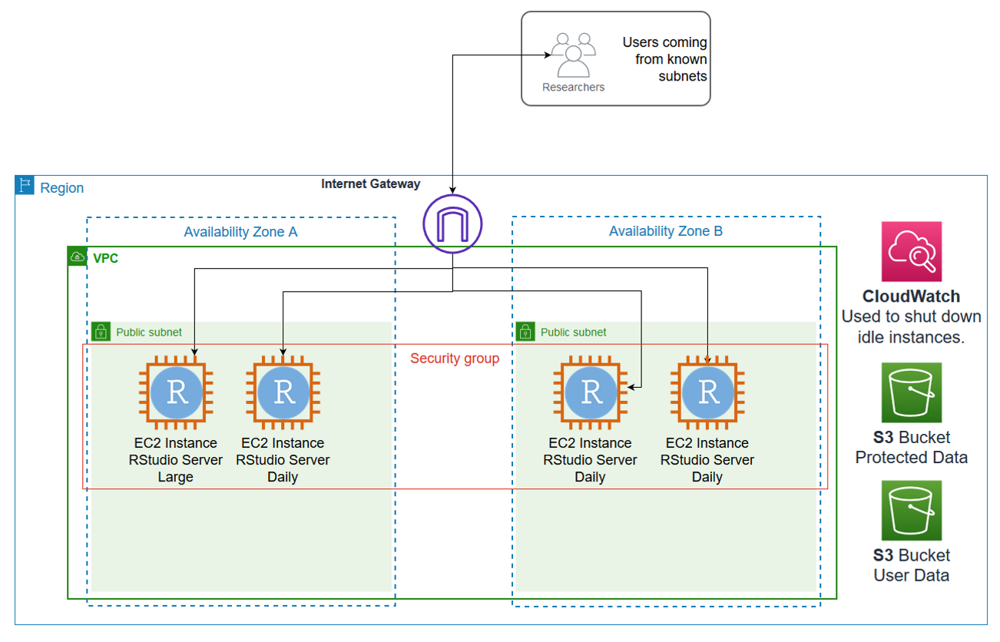
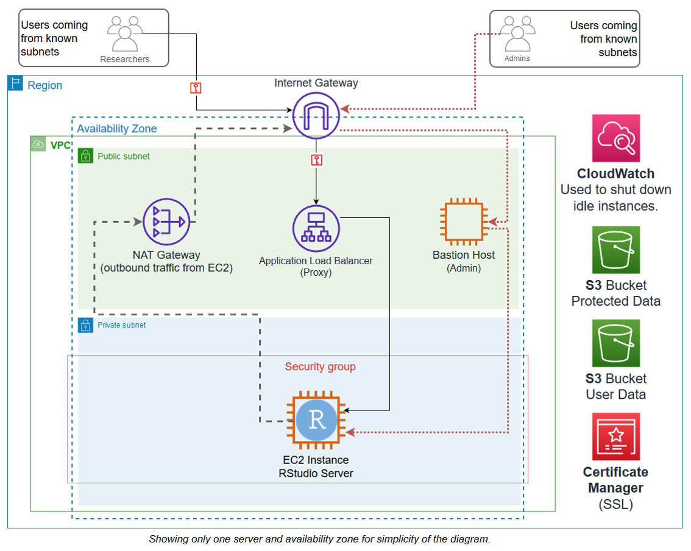

# **RStudio Server (Open Source) running on AWS**

This project is an example on how to build an RStudio Server (Open Source) environment in [AWS](https://aws.amazon.com).  It allows for both proxied and direct access of the RStudio Server instances from a known subnet.  

***

## **Features**

This solution uses a combination of the following services on [AWS](https://aws.amazon.com)

* VPC - Virtual Private Cloud
  * Subnets - both private and public depending on your configuration
  * Route tables
  * Security Groups
* Cloudformation
  * This is AWS's infrastructure as code solution.  99% of the work of this setup is done by CloudFormation
* EC2 - Elastic Cloud Compute
  * This is what runs the RStudio Software
  * All software installed on Amazon Linux 2 through the use of CloudFormation UserData.  So it does take 20 minutes to install give or take.
  * The EC2 Instance is assigned an IAM Policy/Role that allows it to be accessed by Systems Manager and has access to S3 Buckets (one that is read only, and one that is writeable by all EC2 instances in the created environment)
* Application Load Balancer - This is used for proxying an instance.  It allows the EC2 instances to live in a private subnet but still be accessible.
  * This also allows traffic to RStudio Server to be encrypted with SSL up to the Load Balancer since RStudio Server Open Source doesn't have HTTPS capability.
* S3 - Simple Storage Service
  * Since the instances are meant to be non-permanent if possible.  All persistent data should be stored in S3.
    * One bucket for read only data, maybe source data, scripts, etc.
    * One bucket that can be written to by any instance, this would be for saving data persistently.
* CloudWatch - AWS's monitoring and observability service
  * If configured to do so, the EC2 instances will have a CloudWatch alarm set to shut it down if it's idle for too long.  This is to safe costs since you pay for the compute time of running instances.  
  (*Note:  Even if the instance is off, you will still incur charges for storage and static ips if attached.*)

***

## **Asset List**

Asset | Description
----- | -----------
/CFN/r-studio-network-stack.yaml | Cloudformation template that creates the networking components (VPC, Subnets, Route Tables, ALB, etc.)
/CFN/r-studio-server-instance.yaml | Cloudformation template that creates the instance, either proxied or direct access depending on the parameters given.
/ASSETS/r-studio-direct-access.png | Diagram of basic flow for direct access instances.
/ASSETS/r-studio-proxied-access.png | Diagram of basic flow for proxied access instances.
Readme.md | This markdown.

***

## **CloudFormation templates detail**

### **r-studio-network-stack.yaml**

This template creates the VPC and network for the RStudio environment, it uses parameters to build out components for each instance type (Direct Access or Proxied.)

#### **Assumptions:** r-studio-network-stack.yaml

* If you're going to do proxied instances, you already have a domain which you can verify and create records.
  * Will be needed to issue a certificate in Certificate Manager.
  * Will be needed to point an A or CNAME record to the created load balancer.
* Your user base comes from one subnet.
* You want all of the instances to be able read from one S3 bucket and read/write to another.

#### **Parameters:** r-studio-network-stack.yaml

* **Main Configuration**
  * **Project Tag**: This is a string used to create a tag for created resouces which can be used as a billing tag in AWS.  It's also part of some of the created resource names.
  * **Source subnet block for instance user.**: The subnet from which the users will connect to these instances. Typically this is the IP block used by the organization.
* **Direct Access RStudio Server Information**
  * **Directly accessed instances?**: Will this environemnt have directly accessible instances?  Will create the approprate resources (Security Group mainly)
* **Proxied RStudio Server Information**
  * **Proxied Instances**: Will this environment have RStudio Server instances accessed through the application load balancer?  If yes, required components are created.  (Application Load Balancer, NAT Gateway, Private Subnets, etc.)
  * **SSL Certificat ARN**: The ARN of the Certificate Manager certificate to be used with the load blanacer for SSL traffic, this is only required if you have proxied instances.
  * **SSL Certificate Domain**: The domain for which the certificate was issued.  Only required if proxied instances are going to be created.
  * **Load balancer default redirect**: If someone tries to connect to the load balancer without a valid path, where should they be redirected?  (Should be an HTTPS capable domain.)
* **S3 Buckets**
  * **S3 Read Only bucket**:  The ARN of the S3 bucket from which all of the instances can pull data, but not write.
  * **S3 User Data bucket**:  The ARN of the S3 bucket frm which all of the instances can read and write data.  
  
### **r-studio-server-instance.yaml**

  This template creates the RStudio Server instance.  It assumes you've already run the network stack and know the stack name.  It relies on exports from that stack to provision resources.

#### **Assumptions:** r-studio-server-instance.yaml

* You've already setup an appropriate EC2 Key Pair to be used.
  
#### **Parameters:** r-studio-server-instance.yaml

* **General Information**
  * **Network Cloudformation Stack Name**:  The name of the network stack you created with the r-studio-network-stack.yaml.  Needed to pull in exported values.
  * **Access Method**: How will this RStudio Server instance be accessed?
    * *Direct*: The instance will be placed in a public subnet and be accessible directly from the user source subnet over http. Ex. ```http://1.2.3.4:8787/```
    * *Proxied*: The instance will be placed in a private subnet and will be accessible as a path proxied through the load balancer over https to a path.  Ex. ```https://research.somelab.com/userstation1```, the path is determined by the stack name.
* **Proxy/Load Balancer Information**
  * **Load balancer Rule Priority for instance**:  This is only needed if it is a proxied instance.  It will be a number between 2 and 49999 that is not already in the list of other proxied instances.  The load balancer evaluates the paths in a specific order, the most important thing is to make sure it's not a duplicate value.
* **Direct Access Information**
  * **RStudio Server Port**: This is only needed if the instance will be directly accessed and not proxied.  What port should RStudio Server listen on?  Port 8787 is the default but 80 (standard HTTP) and 8080 are also options.
* **Server Configuration**
  * **Instance Size**: Since AWS has over 300 instance types, they are extracted into T-Shirt size options of Small, Medium, and Large.  How *big* of an instance do you need?
    * *Small*: t3.micro, (2vcpu, 1GB Memory), good for testing configurations without incurring much cost.
    * *Medium*: m5.4xlarge, (16vcpu, 64GB Memory), good for general workloads or development.
    * *Large*: m5.12xlarge, (48vcpu, 192GB Memory), this would be for larger batch jobs.
  * **Disk Size**: The size in GB of the disk.  A gp3 disk with 16k IOPS will be provision to this size as the root volume.
  * **Shut down when idle?**: If set to yes a CloudWatch alarm will be configured to shut down the instances if its below 5% CPU utilization for 45 consecutive minutes.
* **Application Configuration**
  * **Version of R**: What version of R to install?  Currently installed by Amazon Linux Extras and is limited to R4 and R3.4
  * **Primary Owner**: Primary owner username.  Will create a linux user with this name.  Creates a tag on resources for posiible cost tracking and is used in some resource names.
  * **Primary Owner Intial Password**: Used to set the users initial linux password which they should change.  This is not echo'd to the screen.
  * **Project Tag**:  What project is this instance to be used for?  Creates a tag on resources for posiible cost tracking and is used in some resource names.

***

## **Environment Diagrams**

### **Direct Access Diagram**

A basic diagram of how the communication flow will happen for researchers and users directly accessing the RStudio Server, this done via HTTP protocol on specified ports.


***

### **Proxied Access Diagram**

A basic diagram of how researchers  can access the RStudio servers.  Instead of directly accessing the RStudio it's through a base url and path which is handled by an application load balancer (ALB).  This allows for HTTPS communication up to the ALB.


